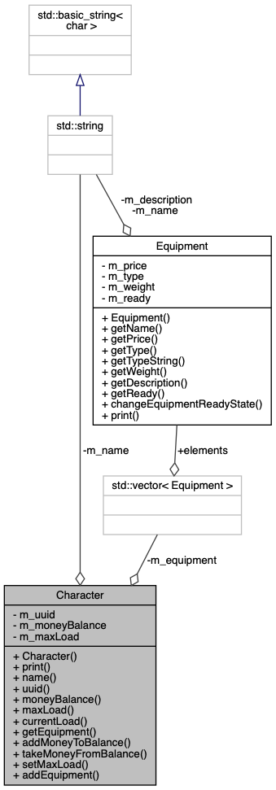
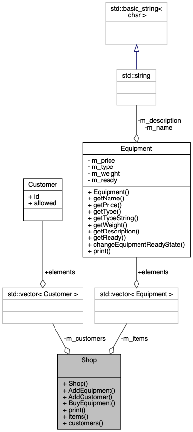

# RPG Classes #

Dette repository vil blive brugt til at lære hvordan man bruger klasser i C++.


## Logbog

### 2020/03/13

I dag gik vi igang med et projekt omkring hvordan man bruger klasser i c++, først gik vi igennem teorien ved brug af internetlæringsvideoer på youtube, da det foregik hjemmefra. Da videoerne var ret lange, blev de set på 1,75x hastighed. Herefter blev opgavebeskrivelsen læst hvorefter opgave 1 blev lavet. Det foregik ved først at sætte et repository op på både Github og Bitbucket. Herefter blev projektet lavet og IDE blev sat op med filerne nødvendige for at løse opgaven. 

 

Der blev først lavet en klass hvor de forskellige metoder og medlemvariabler blev sat op. For at gemme dataen blev der lavet en struct ved navn Character, hvori der blev gemt navn, xp og level. I party klassen blev der lavet en vector til at holde charactersne. 

Inden hver funktion blev lavet, så blev der skrevet nogle få kommentare til hvordan funktionen skulle forløbe, herefter blev implementeringen lavet. Der blev desvære taget brug af en goto i funktionen read_xp_level. Til sorteringen blev den indbyggede std::sort brugt.  Der blev også brugt Boost, til nogle funktioner f.eks. til at konverterer strenge til små bogstaver og til at trimme strenge.


### 2020/03/17

I dag blev opgaverne 2, 3 og 4 lavet, som bestod af at implementere klasserne `Equipment`, `Character` og `Shop`. Først blev der defineret de forskellige private medlemsvariabler som klassen skulle bruge, hvorefter der blev lavet nogle offentlige Getter funktioner. Disse funktioner gør at man nemmere kan vælge hvordan dataen i klassen kan modificeres og sørge for at dataen ikke lige pludslig kommer i en ulovlig tilstand fordi en variabel blev ændret uhensigtsmæssigt.  Getteren samt print metoden blev sat som ```const ```,  så man ved at metoden ikke kan ændre på dataen, og derfor er den sikker at kalde fra en anden funktion, som har fået en konst reference, hvilket tages brug af i den for løkke som bruges til at printe alt equipment for en character. For at genererer de id hver character har, så bruges Boost biblioteket. I equipment klassen blev der brugt en enum, til at holde styr på hvilken type udstyr det var. Det gode ved en enum klasse er at de forskellige typer at klart defineret og samlet. Dog er det svært at printe navnet ud for dem, og man har derfor brug for en hjælpefunktion med en switch som tager en enum ind og returnere en streng. 

For at teste programmet blev der lavet en simpel while loop, hvor man kan indtaste en kommando og så bliver den tilhørende funktion kaldet. Her kan man også indtaste print funktionerne for at se hvordan dataen bliver ændret. 


### 2020/03/20

I dag blev opgave 5 påbegyndt og der blev implementeret metoder til at konstruere en ``Money `` klasse samt at få fat i antallet at penge i både bronze, sølv og guld form. Der blev også lavet metoder til at tilføje penge samt at printe antallet at penge ud i en form hvor tallene er mindst muligt, altså der vil aldrig blive printet mere end 100 bronze eller sølvstykker ud. I starten af dagen blev der spildt noget tid i forsøg på at bruge GMP biblioteket for at få adgang til multipræcisionstal i c++, dog blev det droppet da programmet ikke ville kompilere. Der blev også kigget på programmeringsparadigmer.

#### Øvelse procedural programmering

- Undersøg begræbet modulær programmering og sammenlign med C++
  - Modulær programmering er en måde at opdele programmet i små udskiftelige moduler som står for en meget specifik del af programmet og fungerer uafhængigt fra resten af programmet. Dette er godt fordi at programstrukturen bliver mere overskuelig og man kan nemmere undgå fejl, samtidig er det også nemmere at arbejde flere da de forskellige moduler skal kunne fungere uafhængigt med et veldefineret interface. Man kan gøre brug af dette paradigme i C++ ved hjælp af klasser og namespaces.
- Undersøg begrebet *"Side effect"* og sammenlign det med C++
  - En side effect er når en funktion eller metode ændrer en ekstern state. Dette er ikke godt at have for det reducerer hvor genbrugelig koden er og det gør også sværere at forstå hvad en funktion helt præcis gør. I c++ kan man sætte en funktion som const, og så ved man at der ikke bliver modificeret noget data når funktionen bliver kaldet.

#### Øvelse objekt orienteret programmering

- Forskelle mellem procedural og objekt orienteret programmering
  - Procedural programmering bruger funktioner og moduler hvor objekt orienteret programmering bruger objekter og metoder
- Fordele ved objekt orienteret programmering
  - Man er mere skalerbart og kan være nemmere at dele op i moduler og for at udvikle videre behøver man ikke at kende hele programstrukturen. Man kan også nemmere arbejde parallelt


#### Eksempel på objekt orienteret programmering:

```c++
struct Customer {
    boost::uuids::uuid id;
    bool allowed;
};

bool operator==(const Customer& lhs, const Customer& rhs);

// Der er en klasse som hedder Shop og holder styr på hvilket equipment der er i butikken
// Shoppen behøver ikke at bekymre sig om implementeringen af equipment.
class Shop {
    // en klasses variabler er som udgangspunkt private, derfor er følgende medlemsvariabler private og kan kun blive modificeret af klassens metoder.
    std::vector<Equipment> m_items;
    std::vector<Customer> m_customers;

public:
    // Her er konstruktøren til klassen, og står for at danne instanser af denne klasse. 
    Shop();

    void AddEquipment(const Equipment& equipment);
    void AddCustomer(const Character& customer, bool allowed);

    void BuyEquipment(Character& character, uint equipmentNr);

  	// Når print er erklæreret konst så ved man at den ikke har nogle side-effects
    void print() const;

    std::vector<Equipment> items() const;
    std::vector<Customer> customers() const;
};
```


### 2020/03/25

I dag arbejdede vi med klassediagrammer. Jeg brugte starten af timen på at afslutte opgave fra sidste gang og tilføjede lidt kommentare til eksemplet og lavede en snippet på bitbucket. Herefter valgte jeg at lave et klassediagram til opgave 2-4 med doxygen. Jeg brugte den manuelle metode til at konfigurere doxygen, dog genererede den ikke diagrammerne efter at have fulgt guiden på bitbucket, da jeg glemte at slå HAVE_DOT til. Jeg gik så igang med at afslutte opgave 5, ved at implementere en funktion til at trække penge ud og til at konstruere et objekt ud fra en streng.


#### Klassediagram til opgave 2-4

##### Character



Her ses et klassediagram over Character klassen, som er den grå boks i bunden. Øverst ses medlemsvariablerne og nederst ses metoderne. I denne klasse er alle medlemsvariablerne private og alle metoderne offentligte, hvilket ses ved om der er enten et plus eller et minus som henholdsvis står for offentlig eller privat. Man kunne dog også have haft private metoder, men de metoder som man kunne have lavet private, blev omdannet til hjælpefunktioner som ligger uden for klassen. Ud over de variabler der er inde i den grå boks, så er der også nogle pile fra de andre bokse. Her ses der en equipment vector ved navn m_equipment, der bliver også brugt en streng fra stl. 

##### Shop



### 2020/03/27

I dag nået jeg ikke så meget, da jeg har lavet mange af skal opgaverne og der var kun udvidelse af klasserne eller et textadventure tilbage. Jeg startede med textadventure opgaven og startede med at overveje hvordan jeg ville starte på opgaven, men jeg besluttede bare at fortsætte med at udvide de andre klasser i stedet hvor jeg gik igang med at lave CMake filerne om så jeg kunne bruge moneyklassen i de andre klasser. Efter jeg havde gjort det gik jeg igang med operator overloading så jeg nemt kunne addere 2 money objekter, dog blev jeg ikke helt færdig med det.